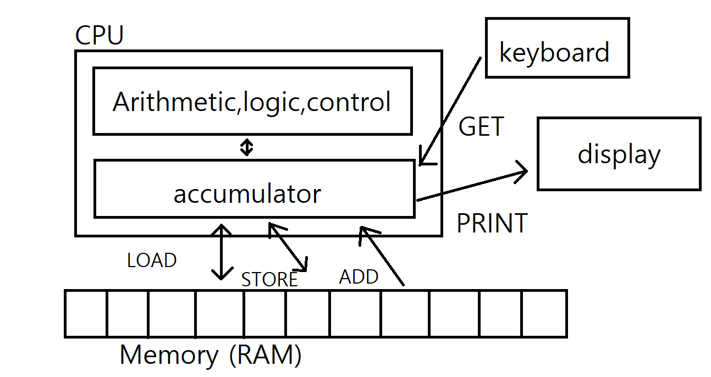

# CPU

Arithmetic : 연산

logic : 큰지 작은지 같은지 비교

control : 메모리 포함 기타 컨트롤

accumulator : CPU의 저장장치(산술 논리 장치 결과 저장)

## To run the program:

Assembler => OS => CPU

---

### Assembler

convert these instructions into numbers

어셈블리를 어셈블러로 변환 = 어셈블리어를 기계어로 변환

assembly language => assembler

쉽게 말해서 명령어를 숫자로 변환

---

### OS(Operating System)

put them into RAM starting at first lcation
Tell CPU to start processing instructions at first location

OS는 메모리(RAM)의 첫번째 위치에서부터 명령을 시작함

---

### CPU

Fetches GET , decodes it , executes it  
Fetches PRINT , decodes it , executes it   
Fetches STOP , decodes it , executes it  

ex)  
GET   Get a number from keyboard   
STORE Fst   Store it at memory location named "Fst"  
GET   Get another number from keyboard   
STORE Snd   Store it at memory location named "Snd"  
SUB Fst   Accumulator <= Accumulator - Fst   
IFPOS Zwei    If Accumulator <= Accumulator - Fst  
LOAD Fst    Accumulator <= Fst   
GOTO Show   Jump to "show"   
Zwei LOAD Snd   Accumulator <= Snd   
Show PRINT    Print accumulator  
STOP   
Fst   0  
Snd   0  

https://www.cs.princeton.edu/courses/archive/fall14/cos109/toysim

---

### Representation in RAM

Numeric Value of Instructions

|Syntax reminder|Num|info|
|---|---|---|
|GET|1|get a number from keyboard into accumulator|
|PRINT|2|print contents of accumulator|
|STORE|3|store contents of accumulator into memory location called M (accumulator unchanged)|
|LOAD|4|load accumulator with Val (Val unchanged)|
|ADD|5|add Val to contents of accumulator (Val unchanged)|
|STOP|6|stop running|
|GOTO|7|go to instruction labeled L|
|IFZERO|8|go to instruction labeled L if accumulator is zero|

|Location|Memory|Label|Instruction|
|---|---|---|---|
|1|1|TOP|GET|
|2|8||IFZERO Bot|
|3|10|||
|4|5||ADD Sum|
|5|14|||
|6|3||STORE Sum|
|7|14|||
|8|7||GOTO Top|
|9|1|||
|10|4|Bot|LOAD Sum|
|11|14|||
|12|2||PRINT|
|13|6||STOP|
|14|0|Sum|0[data, initialized to 0]|
