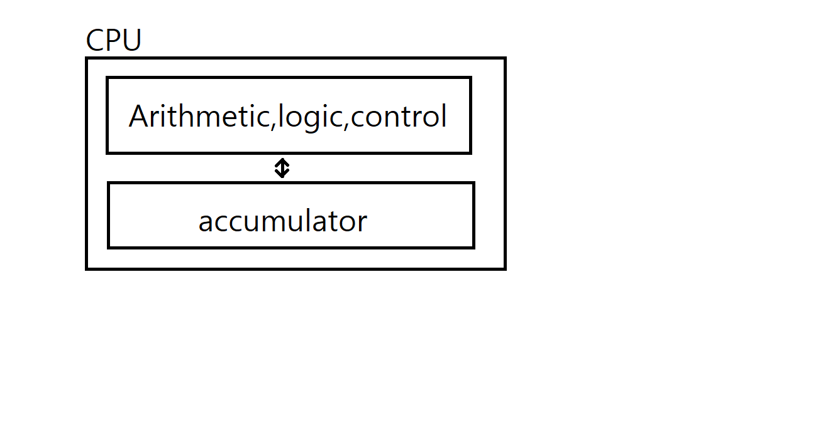

# CPU

## To run the program:

Assembler => OS => CPU

### Assembler

convert these instructions into numbers

어셈블리를 어셈블러로 변환 = 어셈블리어를 기계어로 변환

assembly language => assembler

쉽게 말해서 명령어를 숫자로 변환

### OS(Operating System)

put them into RAM starting at first lcation
Tell CPU to start processing instructions at first location

OS는 메모리(RAM)의 첫번째 위치에서부터 명령을 시작함

### CPU

Fetches GET , decodes it , executes it
Fetches PRINT , decodes it , executes it
Fetches STOP , decodes it , executes it

ex)  
GET   Get a number from keyboard   
STORE Fst   Store it at memory location named "Fst"  
GET   Get another number from keyboard   
STORE Snd   Store it at memory location named "Snd"  
SUB Fst   Accumulator <= Accumulator - Fst   
IFPOS Zwei    If Accumulator <= Accumulator - Fst  
LOAD Fst    Accumulator <= Fst   
GOTO Show   Jump to "show"   
Zwei LOAD Snd   Accumulator <= Snd   
Show PRINT    Print accumulator  
STOP   
Fst   0  
Snd   0  
